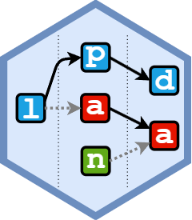
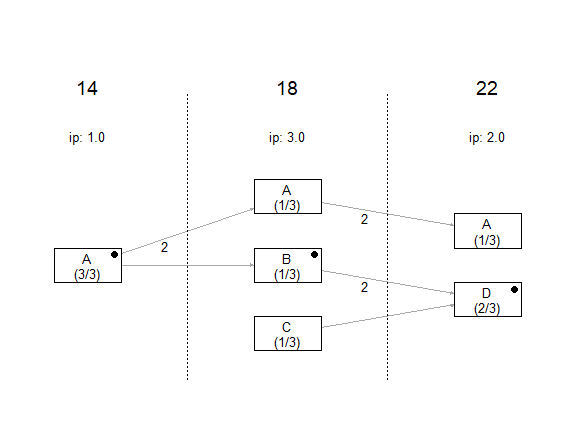
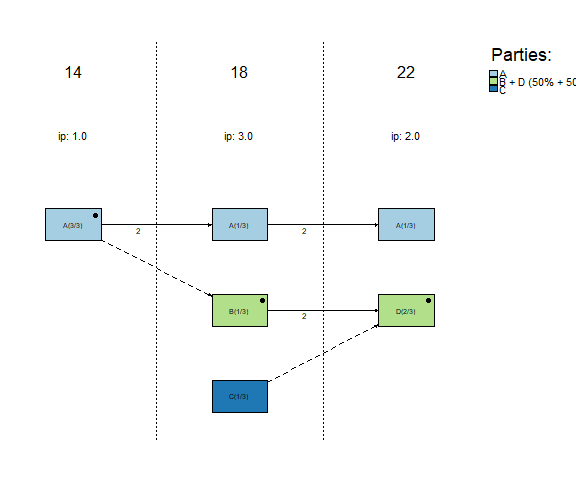
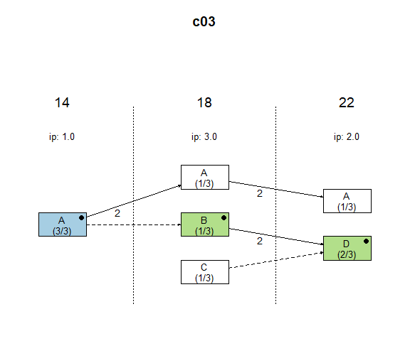
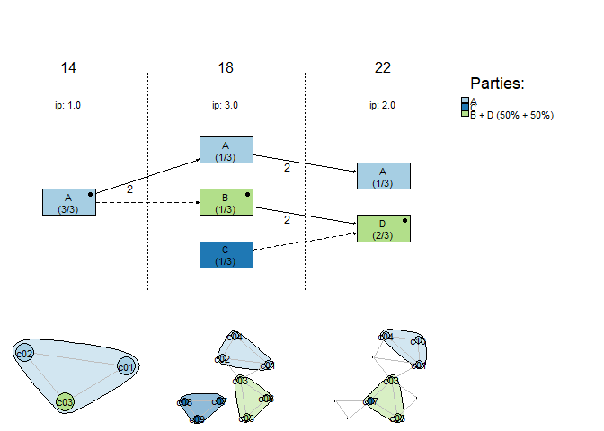

<!-- README.md is generated from README.Rmd. Please edit that file -->

# lpanda <a href="https://localpolitics.github.io/lpanda/"></a>

### Local Political Actor Network Diachronic Analysis Tools

<!-- badges: start -->

[](https://github.com/localpolitics/lpanda/actions/workflows/R-CMD-check.yaml)
[](https://app.codecov.io/gh/localpolitics/lpanda)
[](https://CRAN.R-project.org/package=lpanda)
[](https://CRAN.R-project.org/package=lpanda)
[](https://doi.org/10.32614/CRAN.package.lpanda)
[](https://doi.org/10.5281/zenodo.17808040)
<!-- badges: end -->

## Overview

The R package `lpanda` provides tools for preparing, analyzing and
visualizing diachronic network data from municipal election results. It
is designed to make it easier to study local political actor networks,
with a particular focus on the development of local party systems’
format, especially in small municipalities.

The core functionality centres on continuity diagrams that trace
candidacies of local political actors across multiple elections. In
addition, `lpanda` can visualise the evolving candidate-candidate
network over time, helping to explore how electoral groupings emerge,
stabilise, fragment or realign across successive elections.

## Installation

You can install the released version of `lpanda` from CRAN with:

``` r
install.packages("lpanda")
```

Or install the development version from [GitHub](https://github.com/)
with:

``` r
devtools::install_github("localpolitics/lpanda")
```

## Usage

To create a basic continuity diagram of candidacies of local political
actors, it is necessary to prepare election data containing at least
unique names of candidates, unique names of the candidate lists they ran
on, and the years of the elections. If the same names occur more than
once, they need to be distinguished, e.g., by adding numbers after the
names of candidates (for example, “Jane Doe (2)” or “Smith John, Jr.”)
or candidate lists (for example, “Independents 3”). Then just use the
`plot_continuity()` function.

``` r
library(lpanda)
#> lpanda (0.2.1) successfully loaded. Type ?lpanda for help.
## basic example code
data(sample_data, package = "lpanda")
df <- sample_data
plot_continuity(df)
```



However, the usefulness of the package lies in the simplicity of
converting basic data into network data, which can be used not only with
the `lpanda` package, but also with other packages for social network
analysis.

The following example shows how raw data is converted to network data.
The output is a list of networks that contain edgelist and node
attributes that can be directly used for social network analysis. The
last item contains statistics of the included elections.

``` r
netdata <- prepare_network_data(sample_data, verbose = FALSE)

str(netdata, max.level = 2)
#> List of 6
#>  $ bipartite :List of 2
#>   ..$ edgelist :'data.frame':    18 obs. of  5 variables:
#>   ..$ node_attr:'data.frame':    16 obs. of  20 variables:
#>  $ candidates:List of 2
#>   ..$ edgelist :'data.frame':    15 obs. of  3 variables:
#>   ..$ node_attr:'data.frame':    10 obs. of  10 variables:
#>  $ lists     :List of 2
#>   ..$ edgelist :'data.frame':    7 obs. of  3 variables:
#>   ..$ node_attr:'data.frame':    6 obs. of  11 variables:
#>  $ continuity:List of 2
#>   ..$ edgelist :'data.frame':    5 obs. of  3 variables:
#>   ..$ node_attr:'data.frame':    6 obs. of  11 variables:
#>  $ parties   :List of 2
#>   ..$ edgelist :'data.frame':    2 obs. of  3 variables:
#>   ..$ node_attr:'data.frame':    3 obs. of  11 variables:
#>  $ elections :List of 2
#>   ..$ edgelist :'data.frame':    3 obs. of  3 variables:
#>   ..$ node_attr:'data.frame':    3 obs. of  7 variables:

# election stats
print(netdata$elections$node_attr)
#>   vertices is_isolate cands seats elected lists plurality
#> 1       14      FALSE     3     3       3     1         1
#> 2       18      FALSE     9     3       3     3         3
#> 3       22      FALSE     6     3       3     2         2
```

For diachronic analysis of the continuity of candidacies of local
political actors, a number of parameters in the `plot_continuity()`
function can be used (see `?plot_continuity`). These help identify
political parties (clusters of candidate lists) and track the behaviour
of individual actors across elections, for example when studying the
stability of local party systems or the career paths of specific
councillors.

``` r
# identified "political parties"
plot_continuity(
  netdata,
  mark = "parties",
  separate_groups = TRUE,
  do_not_print_to_console = TRUE
)
```



``` r

# tracking the candidacies of candidate "c03"
plot_continuity(
  netdata,
  mark = c("candidate", "c03"),
  do_not_print_to_console = TRUE
)
```



Adding the `show_candidate_networks` argument extends the continuity
diagram with an additional bottom panel showing candidate-candidate
network snapshots for each included election. Nodes are coloured by
long-term group affiliation (e.g. detected “parties”), while node
borders indicate the candidate lists used in each election. This makes
it possible to inspect how electoral groupings are composed, how
cohesive they are internally, and how they may fragment, merge, or
realign over time.

``` r
# candidate network snapshots coloured by groups and bordered by lists
plot_continuity(
  netdata,
  mark = "parties",
  show_candidate_networks = TRUE,
  do_not_print_to_console = TRUE
)
```



## Included datasets

`lpanda` contains several sample datasets from Czech municipal
elections. These include both small, fictitious samples (such as
`sample_data`, used in the examples above) and real-world case studies
of individual municipalities.

The case-study datasets combine official election results with field
research and previously published analyses of Czech local politics. They
can be used to reproduce published continuity diagrams, to experiment
with the workflow, or as templates for preparing your own data.

You can see an overview of available datasets by running
`help("lpanda")` and inspect individual objects via their help pages
(e.g., `?sample_data`, `?Doubice_DC_cz`).
